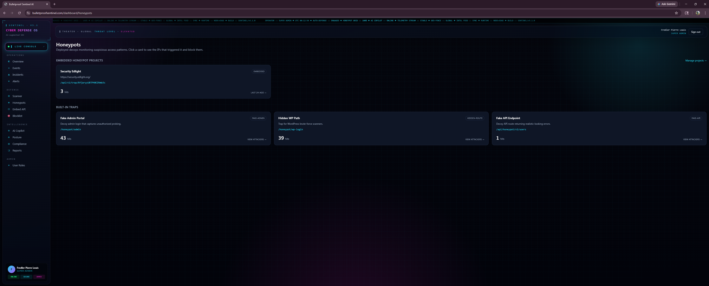

# Bulletproof Sentinel AI

Autonomous AI Cyber Defense Copilot — Phase 1 (MVP Foundation).

Stack: **Next.js 15 (App Router) · TypeScript (strict) · Tailwind CSS · Firebase Auth + Firestore · Vercel**.

## Screenshots

<p align="center">
  
  <br/><em>Live Console — real-time stream of security events and incoming attack traffic.</em>
</p>

**About this view:** The Live Console is the operator's situational-awareness screen. Every authentication attempt, honeypot hit, and API probe is pushed in real time so defenders can watch attacks unfold as they happen. Each row shows the source IP, user agent, target route, severity, and timestamp, making it easy to spot bursts, brute-force patterns, or coordinated scans the instant they start.

---

<p align="center">
  
  <br/><em>Honeypot Dashboard — deployed traps, hit counters, and attacker telemetry.</em>
</p>

**About this view:** The Honeypot Dashboard is the control center for all deployed decoys. It lists every active trap (fake admin portal, decoy API, hidden WP login, etc.), how many times each has been triggered, and which attackers interacted with them. This gives a clear, measurable signal of malicious intent — only someone probing where they shouldn't would ever land on these endpoints.

---

<p align="center">
  
  <br/><em>Fake Admin Panel — decoy login that lures and logs unauthorized access attempts.</em>
</p>

**About this view:** This is one of the deployed honeypots — a convincing fake admin login page designed to attract attackers, scanners, and credential-stuffing bots. Any submission is captured (without ever authenticating anyone) and forwarded to the event pipeline, instantly generating a high-severity alert with the attacker's IP, user agent, and the credentials they tried to use.

---

<p align="center">
  
  <br/><em>Fake WordPress Login — classic <code>/wp-login</code> trap to catch automated scanners.</em>
</p>

**About this view:** A pixel-faithful WordPress login decoy served from `/wp-login`. Automated scanners and botnets constantly hammer this path across the internet, so any hit here is a near-guaranteed indicator of malicious activity. The trap silently logs the attempt, fingerprints the client, and feeds the data into the Alert Center for triage.

## Phase 1 Features

- Firebase Authentication (email + password) with secure HTTP-only **session cookies** (signed via Firebase Admin).
- **Security Dashboard** — overview, stats, recent events, active alerts.
- **Event Logging System** — every auth attempt and honeypot trigger is persisted to Firestore.
- **Basic Honeypot Engine** — fake admin portal, fake API endpoint, hidden WP login route. Hits are recorded and counted.
- **Alert Center** — high/critical events automatically generate alerts that can be acknowledged.
- Route protection via Next.js middleware.

## Project Structure

```
src/
  app/
    (auth)/login, (auth)/signup        # Auth pages (client)
    api/
      auth/session                     # POST: create session cookie, DELETE: sign out
      events                           # GET recent events
      alerts                           # GET / PATCH alerts
      honeypots                        # GET deployed traps
      honeypot/v1/users                # Decoy API endpoint
    honeypot/admin                     # Decoy admin login page
    honeypot/wp-login                  # Decoy WP login page
    dashboard/                         # Protected dashboard (overview, events, honeypots, alerts)
  lib/
    firebase/client.ts                 # Web SDK
    firebase/admin.ts                  # Admin SDK (server-only)
    server/session.ts                  # Session cookie helpers
    server/events.ts                   # Event + alert persistence
    server/honeypots.ts                # Trap registry + trigger recorder
    server/request.ts                  # IP / UA helpers
    types.ts                           # Shared TypeScript types
  middleware.ts                        # /dashboard auth gate
```

## Setup

1. Create a Firebase project. Enable **Authentication → Email/Password** and **Firestore**.
2. Copy `.env.example` to `.env.local` and fill in:
   - `NEXT_PUBLIC_FIREBASE_*` from your Firebase web app config.
   - `FIREBASE_SERVICE_ACCOUNT_JSON` — paste the entire service account JSON as a single line. The `private_key` newlines can stay as `\n` (the loader unescapes them).
3. Install deps and run dev:
   ```bash
   npm install
   npm run dev
   ```

## Firestore Collections (auto-created)

- `security_events` — `{ id, type, severity, ip, userAgent, route, message, metadata, createdAt, ownerUid }`
- `alerts` — `{ id, title, severity, source, createdAt, acknowledged, eventId }`
- `honeypots` — seeded on first read with three default traps.

## Suggested Firestore Rules

All writes happen via the Admin SDK in API routes, so client writes can be denied:

```
rules_version = '2';
service cloud.firestore {
  match /databases/{db}/documents {
    match /{document=**} {
      allow read, write: if false;
    }
  }
}
```

## Vercel Deployment

1. Push to GitHub.
2. Import the repo on Vercel.
3. Add the same environment variables (mark `FIREBASE_SERVICE_ACCOUNT_JSON` as **Sensitive**).
4. Deploy. No additional firewall configuration required — Vercel handles TLS at the edge.

## Try the Honeypots

After signing in, visit any of these URLs (in another browser or while signed out) — each hit records a high-severity event and creates an alert:

- `/honeypot/admin`
- `/honeypot/wp-login`
- `/api/honeypot/v1/users`

Then return to the dashboard to see events and alerts populate.

## Next Phases

See `prd.md` for the full roadmap. Phase 2 introduces the Vulnerability Scanner, Security Header Analyzer, Threat Scoring Engine, and GeoIP tracking.
