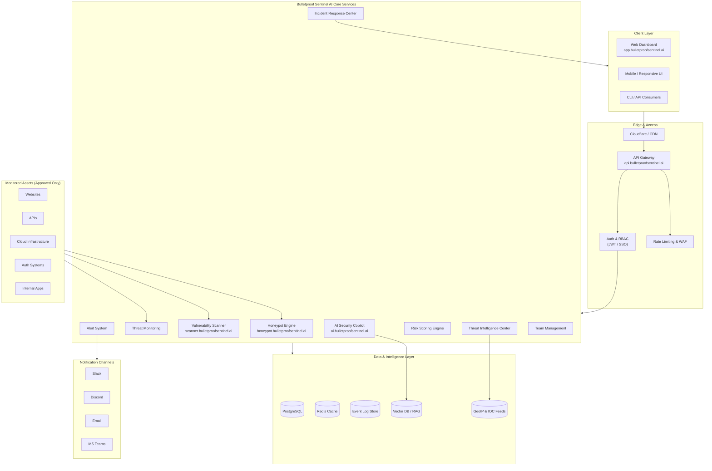
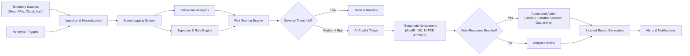
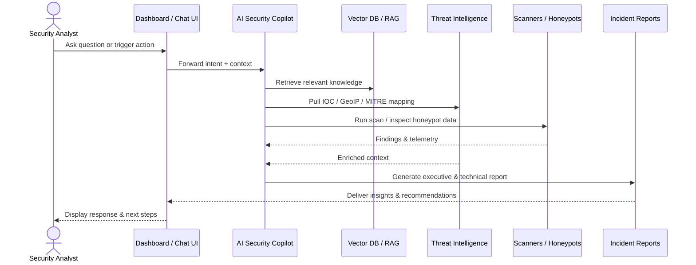
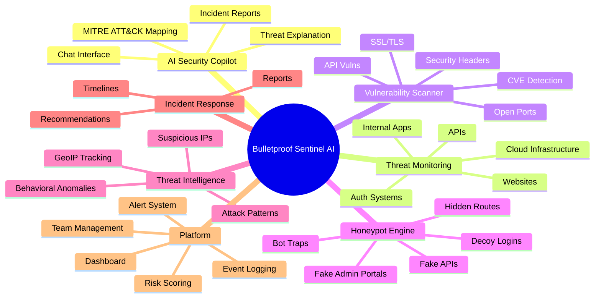
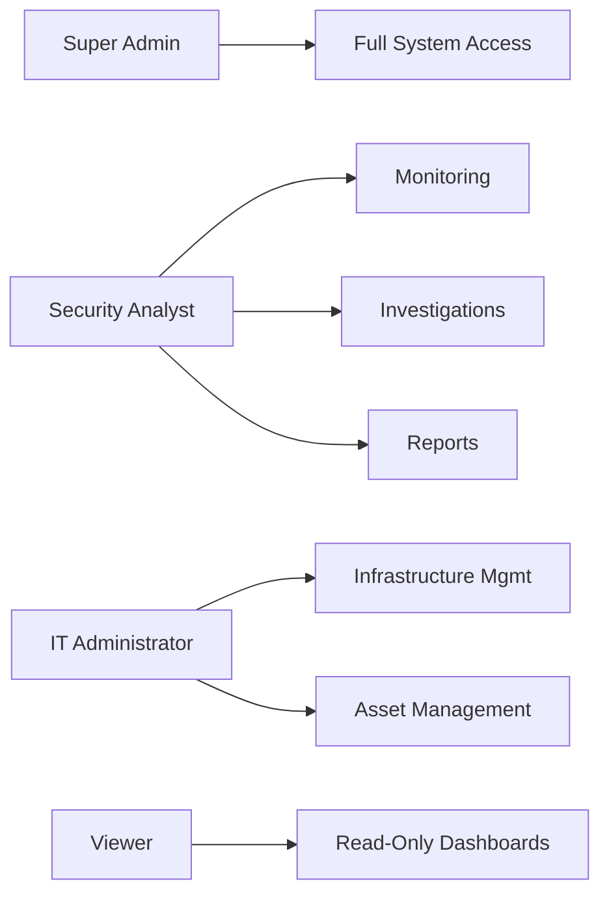
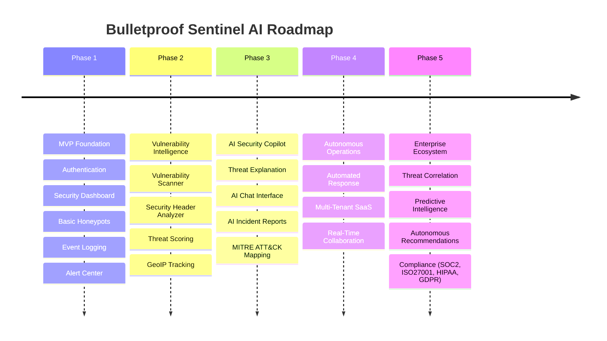
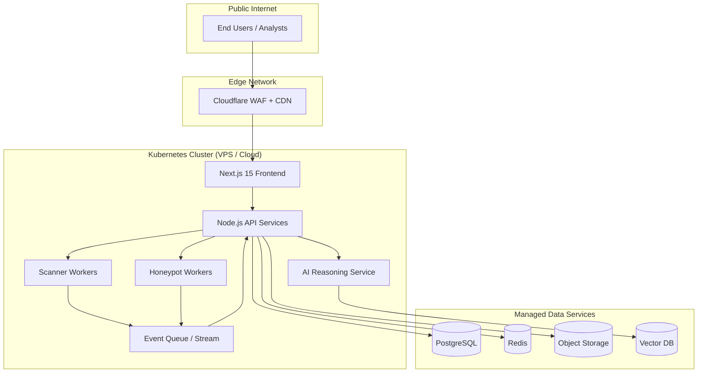

# PRODUCT REQUIREMENTS DOCUMENT

# Bulletproof Sentinel AI

## Autonomous AI Cyber Defense Copilot

---

# 1. Product Overview

## Product Name

Bulletproof Sentinel AI

## Product Category

AI powered cybersecurity monitoring and autonomous security operations platform.

## Product Description

Bulletproof Sentinel AI is a premium cybersecurity copilot designed to help organizations monitor infrastructure, detect suspicious activity, identify vulnerabilities, deploy intelligent honeypots, and automate security operations through a centralized AI powered security platform.

The platform combines real time threat monitoring, vulnerability intelligence, behavioral analysis, security event logging, incident response workflows, and AI assisted cybersecurity analysis into a modern security operations environment built for startups, businesses, educational organizations, and enterprise systems.

Bulletproof Sentinel AI is designed to provide organizations with a centralized cyber defense platform capable of monitoring websites, APIs, cloud infrastructure, authentication systems, and internal applications while helping security teams detect threats earlier, analyze risks faster, and improve overall security visibility.

---

# 2. Vision Statement

Build an enterprise grade AI cybersecurity platform capable of:

* Monitoring organizational infrastructure
* Detecting suspicious behavior in real time
* Scanning approved systems for vulnerabilities
* Deploying defensive honeypots
* Analyzing threats with AI
* Automating cybersecurity workflows
* Generating intelligent incident reports
* Assisting security teams through AI powered cyber defense operations

---

# 3. Product Goals

## Primary Goals

* Centralize cybersecurity monitoring
* Detect and analyze threats
* Improve infrastructure visibility
* Automate vulnerability intelligence
* Deploy intelligent honeypots
* Create AI assisted security workflows
* Build scalable security operations

## Secondary Goals

* Support enterprise environments
* Build SaaS architecture
* Enable future autonomous cyber defense systems
* Improve organizational security posture

---

# 4. Target Customers

## Primary Customers

* Startups
* SaaS companies
* Educational organizations
* Small and medium businesses
* Technology companies

## Secondary Customers

* Cybersecurity analysts
* Internal IT teams
* Managed service providers
* Security operations teams

---

# 5. Core Platform Modules

| Module                     | Purpose                              |
| -------------------------- | ------------------------------------ |
| AI Security Copilot        | AI powered cybersecurity assistant   |
| Threat Monitoring System   | Real time monitoring and detection   |
| Vulnerability Scanner      | Scan approved systems for weaknesses |
| Honeypot Engine            | Deploy and monitor honeypots         |
| Threat Intelligence Center | Analyze suspicious behavior          |
| Incident Response Center   | Manage incidents and reports         |
| Security Dashboard         | Centralized monitoring interface     |
| Event Logging System       | Store and process security events    |
| Risk Scoring Engine        | Calculate threat severity            |
| Infrastructure Monitoring  | Monitor systems and assets           |
| Team Management System     | Roles and permissions                |
| Alert System               | Real time notifications              |

---

# 6. Core Platform Features

## AI Security Copilot

The AI assistant should help users:

* Understand threats
* Analyze suspicious activity
* Explain vulnerabilities
* Generate incident reports
* Recommend security improvements
* Prioritize risks
* Investigate attacks

Users should be able to ask:

* What vulnerabilities are critical?
* Explain this suspicious activity
* Generate a security report
* What should we fix first?
* Why is this behavior dangerous?

---

## Threat Monitoring System

Monitor:

* Websites
* APIs
* Authentication systems
* Cloud infrastructure
* Internal applications
* Security events
* User activity

Detect:

* Suspicious logins
* Route scanning
* API abuse
* Brute force attempts
* Bot activity
* Unauthorized access attempts

---

## Vulnerability Scanner

Scan approved systems for:

* Open ports
* Missing security headers
* Weak SSL/TLS configurations
* Known CVEs
* Exposed admin panels
* API vulnerabilities
* Misconfigured systems
* Outdated software

---

## Honeypot Engine

Deploy defensive honeypots such as:

* Fake admin portals
* Fake APIs
* Hidden routes
* Decoy login systems
* Bot traps
* Fake credentials

When triggered:

* Log attacker behavior
* Capture metadata
* Generate alerts
* Assign risk scores
* Send events to AI analysis engine

---

## Threat Intelligence Center

Analyze:

* Attack patterns
* Suspicious IP addresses
* Threat severity
* Behavioral anomalies
* Repeated attacks
* Infrastructure risks

---

## Incident Response Center

Generate:

* Incident reports
* Threat summaries
* Executive security reports
* Timeline analysis
* Recommended actions

---

# 7. Technical Architecture

## Frontend

* Next.js 15
* TypeScript
* Tailwind CSS
* Framer Motion

## Backend

* Node.js backend architecture
* API driven microservices
* Event processing system

## Infrastructure

* Docker support
* VPS deployment
* Cloud infrastructure
* Kubernetes ready architecture

## Database

* PostgreSQL
* Redis for caching
* Optional Firebase integration

## AI Layer

* AI reasoning engine
* Threat analysis models
* AI assisted report generation
* Security recommendation engine

---

# 8. System Integrations

## Infrastructure Integrations

* Cloudflare
* Vercel
* AWS
* DigitalOcean
* Firebase
* Supabase

## Development Integrations

* GitHub
* GitLab
* CI/CD systems

## Communication Integrations

* Slack
* Discord
* Email alerts
* Microsoft Teams

## Security Integrations

* SIEM platforms
* Firewall systems
* Threat intelligence APIs
* Logging systems

---

# 9. PRODUCT ROADMAP

# Phase 1 — MVP Foundation

## Goal

Build the first operational version of Bulletproof Sentinel AI.

---

## Features Included

### Authentication System

* Secure login
* JWT authentication
* User management
* Role based permissions

### Security Dashboard

Dashboard includes:

* Threat overview
* Security events
* Suspicious IP tracking
* Recent activity
* Risk analytics
* Threat severity indicators

### Basic Honeypot Engine

Deploy:

* Fake admin pages
* Fake API endpoints
* Hidden routes

### Event Logging System

Store:

* IP addresses
* Headers
* Routes accessed
* User agents
* Timestamps
* Threat severity

### Alert Center

Display:

* High risk activity
* Honeypot triggers
* Repeated suspicious behavior

---

# Phase 2 — Vulnerability Intelligence Platform

## Goal

Transform the platform into an intelligent vulnerability monitoring system.

---

## Features Included

### Vulnerability Scanner

Scan approved systems for:

* Open ports
* SSL/TLS weaknesses
* Missing headers
* CVEs
* API vulnerabilities

### Security Header Analyzer

Analyze:

* CSP
* HSTS
* Cookie security
* CORS policies

### Threat Scoring Engine

Calculate:

* Risk level
* Exploit severity
* Threat score

### GeoIP Tracking

Display:

* Country
* Region
* Threat origin
* Attack activity

---

# Phase 3 — AI Security Copilot

## Goal

Create a fully interactive AI cybersecurity assistant.

---

## Features Included

### AI Threat Explanation

AI explains:

* What happened
* Why it matters
* Threat severity
* Recommended actions

### AI Security Chat Interface

Users interact with AI directly for:

* Threat analysis
* Security explanations
* Report generation
* Risk prioritization

### AI Incident Reports

Generate:

* Executive summaries
* Technical reports
* Threat timelines
* Security recommendations

### MITRE ATT&CK Mapping

Map threats to:

* Attack tactics
* Techniques
* Adversary behavior

---

# Phase 4 — Autonomous Security Operations

## Goal

Build advanced autonomous cyber defense capabilities.

---

## Features Included

### Automated Threat Response

Possible automated actions:

* Block IP addresses
* Disable sessions
* Escalate alerts
* Quarantine suspicious activity

### Multi Tenant SaaS Platform

Support:

* Multiple organizations
* Team management
* Tenant isolation
* Subscription system

### Real Time Collaboration

Features:

* Analyst assignments
* Team investigations
* Security notes
* Workflow tracking

---

# Phase 5 — Enterprise AI Cyber Defense Ecosystem

## Goal

Transform Bulletproof Sentinel AI into a next generation enterprise cybersecurity ecosystem.

---

## Features Included

### AI Threat Correlation

Correlate:

* Multi system attacks
* Related threat events
* Infrastructure risks

### Predictive Threat Intelligence

AI predicts:

* Emerging threats
* Potential attack vectors
* Weak infrastructure points

### Autonomous Security Recommendations

AI suggests:

* Hardening improvements
* Access control changes
* Security policies
* Infrastructure upgrades

### Enterprise Compliance Support

Future support for:

* SOC 2
* ISO 27001
* HIPAA
* GDPR

---

# 10. User Roles

| Role             | Permissions                   |
| ---------------- | ----------------------------- |
| Super Admin      | Full system access            |
| Security Analyst | Monitoring and investigations |
| IT Administrator | Infrastructure management     |
| Viewer           | Read only access              |

---

# 11. Security Requirements

## Mandatory Protections

* HTTPS only
* JWT authentication
* API key validation
* Environment variable protection
* Secure logging
* Input validation
* Rate limiting
* Tenant isolation

## Critical Rules

* Platform scans only approved assets
* No unauthorized scanning
* Honeypots isolated from production systems
* No exposure of sensitive credentials

---

# 12. UI / UX Requirements

## Design Direction

Bulletproof Sentinel AI should feel:

* Premium
* Enterprise grade
* AI powered
* Modern cybersecurity focused
* Professional SOC platform

## Interface Requirements

* Dark mode default
* Real time dashboards
* Interactive charts
* Threat analytics
* Premium animations
* Modern enterprise UI

---

# 13. Suggested Infrastructure

## Frontend

app.bulletproofsentinel.ai

## API

api.bulletproofsentinel.ai

## Future Services

scanner.bulletproofsentinel.ai
ai.bulletproofsentinel.ai
honeypot.bulletproofsentinel.ai

---

# 14. Long Term Vision

Bulletproof Sentinel AI aims to become a fully autonomous AI cyber defense ecosystem capable of:

* Monitoring organizational infrastructure
* Detecting advanced threats
* Scanning vulnerabilities intelligently
* Deploying defensive honeypots
* Automating security operations
* Assisting security teams with AI reasoning
* Delivering enterprise grade cybersecurity capabilities through a scalable SaaS platform

---

# 15. Graphic Structure

The diagrams below visualize the architecture, workflows, modules, roles, roadmap, and deployment topology of Bulletproof Sentinel AI. Render with any Mermaid-compatible Markdown viewer (GitHub, VS Code Markdown preview, etc.).

## 15.1 High-Level System Architecture

## 15.2 Threat Detection & Response Pipeline

## 15.3 AI Security Copilot Workflow

## 15.4 Module Breakdown

## 15.5 User Roles & Permissions

## 15.6 Product Roadmap Timeline

## 15.7 Deployment Topology

---

# 16. Live Cyber Defense Interface

## Design Vision

Bulletproof Sentinel AI must feature a real-time cyber defense dashboard inspired by advanced honeypot monitoring systems, security operations centers, hacker intelligence labs, and live threat visualization platforms.

The interface should feel **immersive, premium, technical, and cinematic** while remaining **professional and readable**. The dashboard should look alive at all times.

## Dashboard Experience

The interface should simulate a live cybersecurity operations environment where users can visually monitor:

- Active threats
- Honeypot interactions
- Live attack attempts
- Suspicious IP activity
- Real-time command execution
- Threat intelligence
- Vulnerability scans
- AI threat analysis
- Global attack activity

The dashboard should continuously update without requiring refresh.

## Core Live Dashboard Components

### Live Threat Activity Feed

Display incoming security events in real time:

- Honeypot triggers
- Failed logins
- Route scanning
- API abuse
- Bot interactions
- Fake credential attempts
- Unauthorized access attempts

Each event should animate into the feed live.

### Live Honeypot Session Monitor

A dedicated panel showing:

- Commands attackers attempted
- Session duration
- Attacker behavior
- Fake shell interaction
- Password attempts
- Targeted files / routes

Inspired by real SSH honeypot monitoring systems.

### Live Attack World Map

Interactive animated map displaying:

- Attacker origin locations
- Threat density
- Active attack paths
- Real-time incoming traffic

Map should pulse and animate during attacks.

### Live Threat Statistics

Real-time counters:

- Active attackers
- Connections today
- Unique suspicious IPs
- High-risk sessions
- Vulnerabilities detected
- Honeypot engagements
- Commands executed
- Risk score

Counters should animate continuously.

### AI Threat Intelligence Panel

AI-generated analysis explaining:

- Current attack behavior
- Threat severity
- Suspicious patterns
- Recommended actions
- Attack confidence score

### Live Vulnerability Scanner

Display:

- Open ports
- Security header issues
- SSL/TLS weaknesses
- Exposed endpoints
- Outdated services
- Infrastructure risks

Results should update dynamically.

## Visual Design Direction

### UI Style

The interface should combine:

- SOC dashboard aesthetics
- Terminal-inspired visuals
- Cyberpunk-inspired premium UI
- Hacker intelligence interfaces
- Threat monitoring systems

### Design Requirements

**Theme**

- Dark mode default
- Deep black and dark navy backgrounds

**Accent Colors**

- Neon pink
- Cyan blue
- Purple
- Electric green
- Soft red threat indicators

**Visual Effects**

- Glow borders
- Terminal text animations
- Animated threat pulses
- Live activity indicators
- Smooth transitions
- Interactive charts
- Heatmaps
- Scan animations

**Typography**

- Technical terminal-inspired fonts
- Futuristic cybersecurity appearance
- Readable enterprise layout

## Live Dashboard Infrastructure

### Recommended Real-Time Technologies

- WebSockets
- Firebase realtime listeners
- Supabase realtime
- Redis pub/sub
- Event streaming system

## User Experience Goal

Users should feel like they are operating inside a real-time AI-powered cyber defense command center capable of:

- Monitoring live attacks
- Investigating threats
- Watching honeypot interactions
- Tracking vulnerabilities
- Receiving AI-generated threat intelligence in real time

The dashboard should feel premium enough that companies immediately recognize it as a serious cybersecurity platform rather than a basic admin interface.
